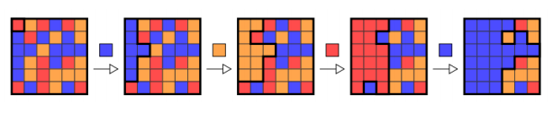

# Offline Coding Task – A Very Popular Game

## 1. Preliminaries and rules

Today’s task is given to you in a short and precise format. By purpose, the scope of the
tasks is very large and it is almost impossible to implement a complete solution within
the given time frame. It is up to you to define and to control the scope! Please focus on
the most important aspects of the task first.

Please proceed in an **incremental way** using **baby steps**! **Ensure** that at any point in
time, your solution **can be executed** and **add small features** one by one. In this way,
the time limit will not hinder you to deliver at least a partial solution – which is very
acceptable!

## 2. Definition of Done

The definition of done for any feature is:

- Unit tests are given that demonstrate the correctness of your code
- The code adheres to high quality standards (as few lines of code as possible), best
practices and a clear structure. The code is easy to read without requiring comments
and uses object oriented features such as inheritance and design patterns to make
the code extensible and easy to maintain
- The resulting software is functional and can be tested by us

## 3. Requirements

Today we are going to implement a popular one player game, which is available on many
smart phones. The player is given an _n x n_ board of tiles where each tile is given one
of _m_ colors. Each tile is connected to up to four adjacent tiles in the North, South, East,
and West directions. A tile is connected to the origin (the tile in the upper left corner) if
it has the same color as the origin and there is a path to the origin consisting only of tiles
of this color. A player does a move by choosing one of the m colors. After the choice is
made, all tiles that are connected to the origin are changed to the chosen color. The game
proceeds until all tiles of the board have the same color. The goal of the game is to
change all the tiles to the same color, preferably with the fewest number of moves
possible.

It has been proven that finding the optimal moves is a very hard computational problem.
It has also been shown that finding the minimum number of flooding operations is NP-
hard for m > 3. This even holds true when the player can perform flooding operations
from any position on the board. However, this variant can be solved in polynomial time
for the special case of m = 2. For an unbounded number of colors, even this variant
remains NP-hard for boards of a dimension of at least n = 3 and is solvable in polynomial
time for boards of dimension n = 2.

For your solution, you will implement a very simple greedy strategy to solve it:

- for each move, choose the color that will result in the largest number of tiles connected to the origin;
- if there is a tie, break ties by choosing the color that has the lowest rank among
the colors.

The following figure depicts a possible sequence of moves together with the chosen
color on a 6 x 6 board initially filled up by 3 distinct colors.

Please implement the game and an automated player that determines the color choice
for each move. We want to determine the amount of moves and the sequence of the
colors chosen by the player over the course of a game. Please use unit tests to proof that
your code is working properly! There is no need to implement any kind of user interface,
simply use your unit test as a driver of your software.

If you can implement the simple greedy algorithm quickly, you might provide an
improved solution using a modified A* algorithm.

